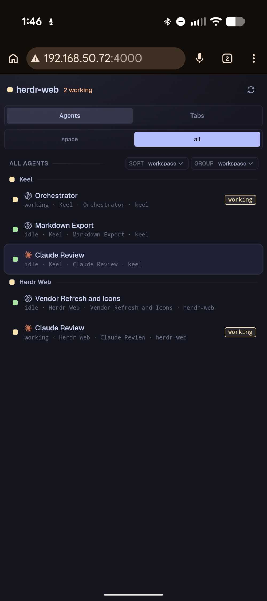
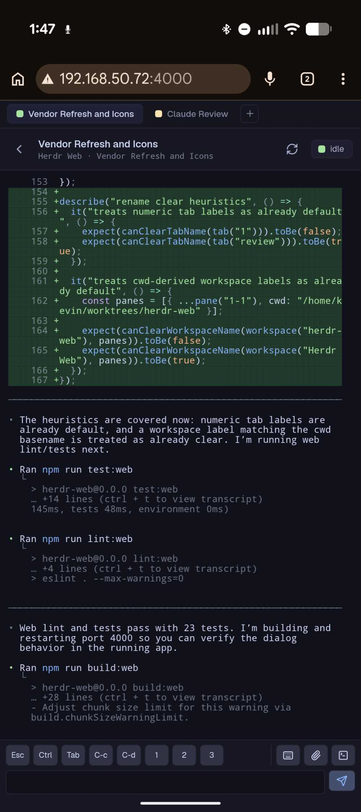

# herdr-web

> W.I.P. prototype. This repository is experimental, the bridge is vendored, and the runtime/API
> shape is expected to change.

Browser UI for Herdr workspaces and agent panes.

This repository is structured as a standalone app that can be distributed without asking users to
modify their installed Herdr checkout. The current bridge is built from a vendored Herdr source
tree because the app needs private Herdr APIs for terminal attach, terminal resize/scroll/input,
workspace snapshots, and event subscriptions.

The goal is to provide a browser-native interface for monitoring and controlling Herdr agents from
desktop and mobile clients. It keeps the terminal experience close to Herdr while adding web-focused
navigation, multi-client viewing, mobile input controls, and synchronized pane selection.

## Screenshots

| Desktop | Mobile switcher | Mobile terminal |
|:--:|:--:|:--:|
|  |  |  |

## Layout

```text
web/                 React + Vite browser app
vendor/herdr/        vendored Herdr source with the web bridge overlay
scripts/run-bridge.sh
scripts/check-vendor.sh
docs/vendoring.md
docs/release.md
```

The bridge is currently compiled as the vendored Herdr binary and run with:

```bash
vendor/herdr/target/debug/herdr web-bridge --static-dir web/dist
```

The top-level scripts hide that detail.

## Requirements

- Node.js 22 or newer
- npm
- Rust stable
- Zig, needed by Herdr's vendored `libghostty-vt` build
- A running Herdr daemon/session

If Zig is not on `PATH`, set `ZIG`:

```bash
export ZIG=/home/kevin/.local/zig/zig
```

## Install

```bash
npm install --prefix web
```

## Build And Test

```bash
npm run lint
npm run test
npm run build
```

Useful narrower commands:

```bash
npm run lint:web
npm run test:web
npm run build:web
npm run bridge:test
npm run bridge:build
scripts/check-vendor.sh
```

## Run Locally

Start or attach a normal Herdr session first:

```bash
herdr
```

Build the web app and bridge:

```bash
npm run build
```

Run the bridge:

```bash
scripts/run-bridge.sh
```

Open:

```text
http://127.0.0.1:8787
```

For LAN/mobile testing:

```bash
HOST=0.0.0.0 PORT=4000 scripts/run-bridge.sh
```

Uploads are saved under `HERDR_WEB_UPLOAD_DIR`, `XDG_DATA_HOME/herdr-web/uploads`, or
`~/.local/share/herdr-web/uploads` by default. Override the bridge upload directory with:

```bash
UPLOAD_DIR=/tmp/herdr-web-uploads scripts/run-bridge.sh
```

The bridge rejects cross-origin browser requests, but it has no full browser authentication yet.
Bind to `0.0.0.0` only on trusted networks.

## Runtime Model

The bridge exposes:

- `GET /api/snapshot`: workspaces, tabs, panes, layouts, and shared web selection
- `POST /api/command`: allow-listed workspace/tab/pane commands
- `POST /api/selection`: bridge-owned selected pane for syncing browser clients
- `POST /api/uploads`: save uploaded files into the configured upload directory
- `GET /ws/events`: Herdr structural events
- `GET /ws/ui-events`: bridge-local UI events such as selection changes
- `GET /ws/terminal`: terminal attach stream

Herdr core currently allows only one terminal attach owner per terminal. The bridge works around
that by opening one Herdr terminal attach per `terminal_id` and broadcasting output to all browser
clients viewing that terminal.

Input, scroll, and resize from any browser are forwarded through the shared attach. Sizing is
currently last resize wins. The header's refit button forces the current browser to send a fresh
fit/resize frame.

Browser-originated API and WebSocket requests must be same-origin with the bridge, with loopback
development proxy origins allowed for Vite. This is a CSRF guard, not user authentication.

Pane selection is bridge-owned. Selecting a pane in one browser updates `/api/selection`, broadcasts
over `/ws/ui-events`, and other browsers switch to the same pane.

## Vendoring Strategy

The vendored tree is intentionally a full Herdr source snapshot with a small bridge overlay. This
is the practical short-term path because the web app needs private APIs that are not available from
released Herdr:

- internal API client and schema types
- client socket path discovery
- terminal attach protocol messages
- terminal ANSI render encoding
- scroll and resize protocol frames

This lets `herdr-web` ship now without asking users to patch their installed Herdr checkout. The
cost is that the bridge must be kept compatible with Herdr protocol changes.

See [docs/vendoring.md](docs/vendoring.md) for the refresh process.

See [docs/release.md](docs/release.md) for release validation, browser smoke testing, tagging, and
GitHub release creation.

## Long-Term Direction

The cleaner upstream shape is for Herdr to expose a supported web bridge or public protocol surface:

- stable snapshot endpoint
- stable command allow-listing
- stable event stream
- terminal attach fanout or multi-client attach
- exact pane focus/selection API
- resize ownership semantics
- browser auth/token support

Once that exists, this repository can drop most or all of `vendor/herdr` and use the public surface.

## Acknowledgements

`herdr-web` builds on several projects and tools:

- [Herdr](https://github.com/ogulcancelik/herdr), the terminal workspace manager this app extends.
- [Ghostty Web](https://www.npmjs.com/package/ghostty-web), used by the browser terminal renderer.
- [Ghostty](https://github.com/ghostty-org/ghostty), including Ghostty VT / `libghostty-vt`,
  vendored through Herdr and used for terminal emulation in Herdr core.
