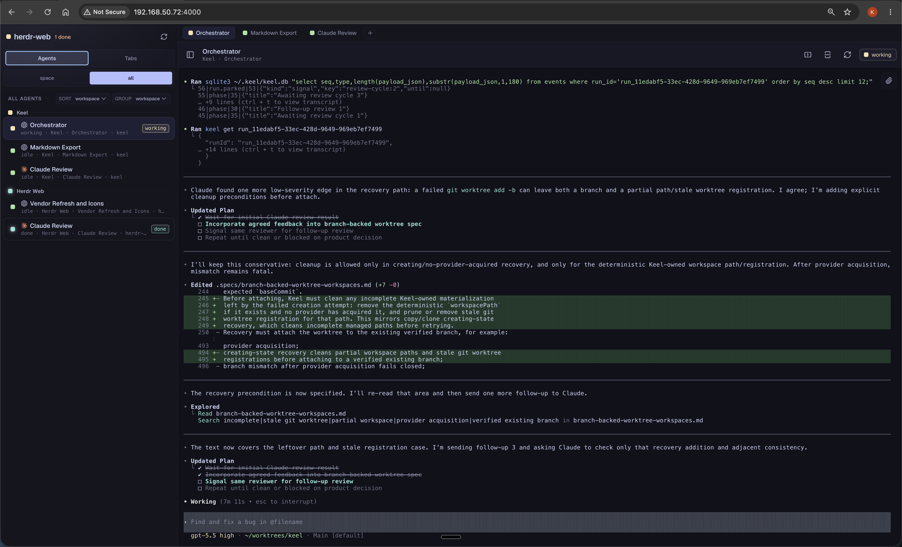
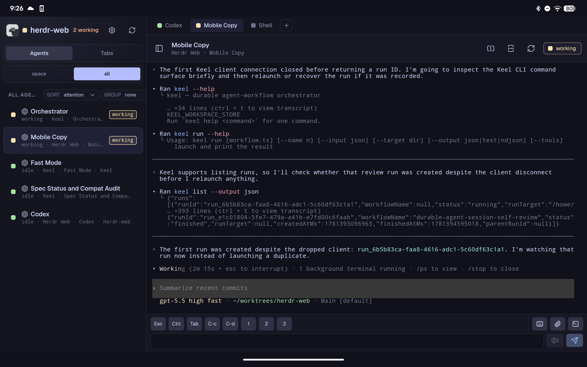
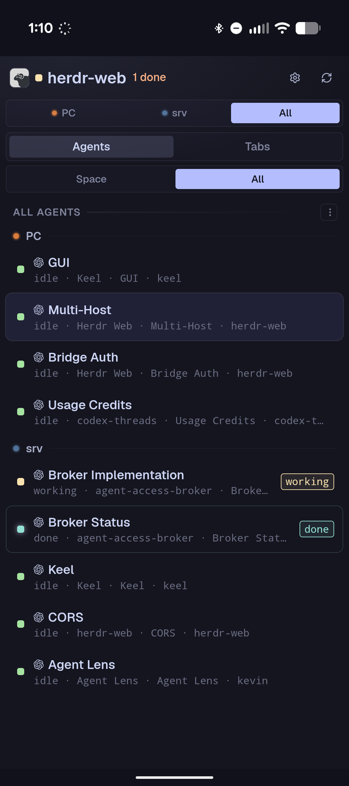
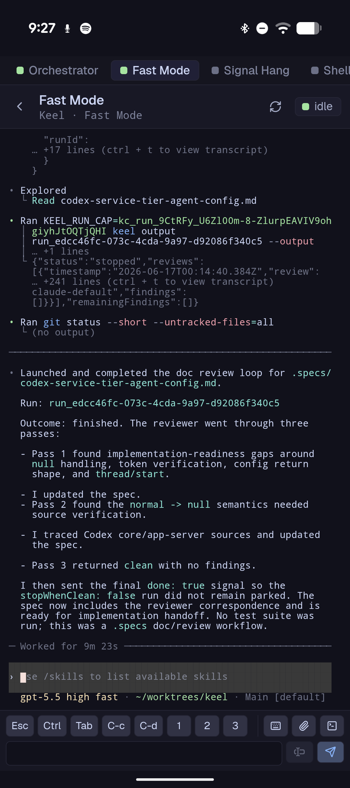
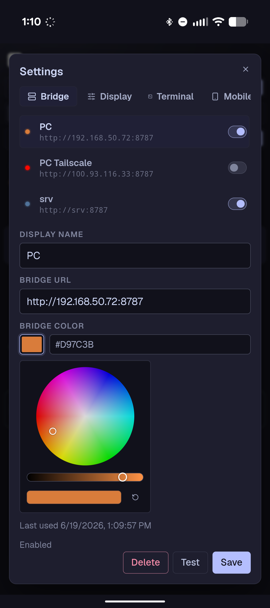

# herdr-web

> This repository is not associated with, endorsed by, or maintained by the official Herdr project.
> It is experimental, Herdr compatibility code is vendored, and the runtime/API shape is expected to
> change.

Browser UI for Herdr workspaces and agent panes.

This repository is structured as a standalone app that can be distributed without asking users to
modify their installed Herdr checkout. The bridge builds as `herdr-web-bridge`, a repo-owned
executable that uses vendored Herdr compatibility code because the app needs private Herdr APIs for
terminal attach, terminal resize/scroll/input, workspace snapshots, and event subscriptions.

The goal is to provide a browser-native interface for monitoring and controlling Herdr agents from
desktop and mobile clients. It keeps the terminal experience close to Herdr while adding web-focused
navigation, multi-client viewing, mobile input controls, and synchronized pane selection.

## Highlights

- Shared browser terminal viewing with synchronized pane selection across desktop and mobile.
- Mobile-friendly text input with stage/send actions, configurable tap focus, and extended
  terminal key controls.
- Agent-focused sidebar with styled icons for detected Codex/OpenAI, Claude, and Pi panes.
- Image and file uploads from the terminal toolbar, paste, or drag/drop, with uploaded paths inserted
  into the active terminal input.
- Context menus for renaming, closing, splitting, and moving panes between tabs or spaces.

## Screenshots

| Desktop | Android tablet |
|:--:|:--:|
|  |  |

| Android phone switcher | Android phone terminal |
|:--:|:--:|
|  |  |

| Android bridge configuration |
|:--:|
|  |

## Layout

```text
web/                 React + Vite browser app
android/             Capacitor Android shell for the bundled web app
bridge/              Slim Rust HTTP/WebSocket bridge executable
vendor/herdr-compat/ minimal Herdr protocol/API compatibility crate
scripts/run-bridge.sh
scripts/check-vendor.sh
docs/android.md
docs/vendoring.md
docs/packaging.md
docs/release.md
```

The bridge is compiled as a repo-owned executable and run with:

```bash
bridge/target/debug/herdr-web-bridge --static-dir web/dist
```

The top-level scripts hide that detail.

## Requirements

For release tarball users:

- A running Herdr daemon/session
- A supported host for the downloaded bridge tarball. Current planned desktop release artifacts are
  Linux x86_64 and macOS ARM64.

For source development:

- Node.js 22 or newer
- npm
- Rust stable
- A running Herdr daemon/session

Android development also needs a JDK and Android SDK. See [docs/android.md](docs/android.md).

## Quick Start From Release

Download the matching desktop tarball from the GitHub release, unpack it, and run the bundled
wrapper:

```bash
tar -xzf herdr-web-vX.Y.Z-linux-x86_64.tar.gz
cd herdr-web-vX.Y.Z-linux-x86_64
bin/herdr-web
```

Open:

```text
http://127.0.0.1:8787
```

The desktop tarball includes the web assets and `herdr-web-bridge`; it does not include Herdr.
Start or attach Herdr separately before running the bridge.

For Android, install the APK from the same release and add the bridge URL in the Bridge area of
Settings. LAN bridges must allow Android's app origin:

```bash
bin/herdr-web --host 0.0.0.0 --port 4000 --allow-origin http://localhost
```

See [docs/packaging.md](docs/packaging.md) for release artifact layout and
[docs/android.md](docs/android.md) for Android behavior.

## Development Setup

```bash
npm install
npm install --prefix web
```

## Development Build And Test

```bash
npm run lint
npm run test
npm run build
```

Useful narrower commands:

```bash
npm run lint:web
npm run test:web
npm run build:web
npm run bridge:fmt
npm run bridge:test
npm run bridge:build
npm run android:sync
npm run android:build:debug
scripts/package-tarball.sh vX.Y.Z linux-x86_64
scripts/check-vendor.sh
```

The Android app is a Capacitor shell around the bundled `web/dist` assets. It starts disconnected
and uses the Bridge area in Settings to save one or more Herdr bridge URLs. Browser-served builds
still default to the same-origin bridge that served the page. See [docs/android.md](docs/android.md)
for HTTP/cleartext behavior, Android SDK setup, and APK verification notes.

## Settings

Settings are grouped by area:

- Bridge: same-origin and saved bridge profiles, reachability testing, and bridge enablement.
- Terminal: browser-to-bridge terminal input transport and input batching delay.
- Mobile: touch-specific terminal behavior when running on a coarse pointer device.

Terminal input payloads can be sent as JSON or binary WebSocket frames. JSON remains the default;
binary is available for comparing terminal input performance. Terminal input batching is off by
default. When enabled, short input chunks are coalesced for `32`, `64`, `128`, or `256` ms and are
flushed early once the pending UTF-8 input reaches 32 bytes, so paste-like input bypasses the delay.

## Run Locally

Start or attach a normal Herdr session first:

```bash
herdr
```

Build the web app and bridge:

```bash
npm run build
```

Run the bridge:

```bash
scripts/run-bridge.sh
```

The launcher uses the installed/stable Herdr socket by default:

```text
~/.config/herdr/herdr.sock
```

This avoids debug builds falling back to Herdr's `herdr-dev` app directory. To target a named or
development Herdr session, either pass `--session NAME` to the bridge or set `HERDR_SOCKET_PATH`
explicitly before running the script.

Open:

```text
http://127.0.0.1:8787
```

For LAN/mobile testing:

```bash
HOST=0.0.0.0 PORT=4000 scripts/run-bridge.sh --allow-origin http://localhost
```

Uploads are saved under `HERDR_WEB_UPLOAD_DIR`, `XDG_DATA_HOME/herdr-web/uploads`, or
`~/.local/share/herdr-web/uploads` by default. Override the bridge upload directory with:

```bash
UPLOAD_DIR=/tmp/herdr-web-uploads scripts/run-bridge.sh
```

The bridge rejects cross-origin browser requests unless the request origin is explicitly allowed.
The bundled Android app uses `http://localhost`, so LAN Android testing needs
`--allow-origin http://localhost`. Bind to `0.0.0.0` only on trusted networks.

For browser-served multi-bridge setups, configure both directions explicitly:

- On the bridge being called, use `--allow-origin ORIGIN` for the web page origin that may call it.
- On the bridge serving the web page, use `--allow-connect-origin ORIGIN` for each other bridge
  origin that the page may connect to. This expands the served page's Content Security Policy for
  both HTTP and WebSocket bridge traffic.

For example, if the page is opened from `http://host-a:8787` and should connect to
`http://host-b:8787`:

```bash
# host A, serving the web page
HOST=0.0.0.0 scripts/run-bridge.sh --allow-host host-a --allow-connect-origin http://host-b:8787

# host B, serving the backend being called
HOST=0.0.0.0 scripts/run-bridge.sh --allow-host host-b --allow-origin http://host-a:8787
```

## Keyboard Shortcuts

These app shortcuts are ignored while dialogs, menus, and normal text inputs are active. They still
work when the terminal's hidden keyboard input has focus. OS-reserved shortcuts such as `Cmd+Tab`,
`Meta+Tab`, or some `Alt+Tab` setups may not reach the browser.

| Action | macOS | Windows/Linux |
| --- | --- | --- |
| Select previous/next agent pane | `Cmd/Option+Shift+Up/Down` | `Meta/Alt+Shift+Up/Down` |
| Select previous/next tab in the active space | `Cmd/Option+Shift+Left/Right` | `Meta/Alt+Shift+Left/Right` |
| Focus split left/down/up/right | `Cmd/Option(+Shift)+H/J/K/L` | `Meta/Alt(+Shift)+H/J/K/L` |
| Cycle split next | `Cmd/Option+Tab` | `Meta/Alt+Tab` |
| Cycle split previous | `Cmd/Option+Shift+Tab` | `Meta/Alt+Shift+Tab` |
| Split selected pane down | `Cmd/Option+Shift+V` | `Meta/Alt+Shift+V` |
| Split selected pane right | `Cmd/Option+Shift+-` | `Meta/Alt+Shift+-` |
| Open the new-tab launch modal | `Cmd/Option+Shift+T` | `Meta/Alt+Shift+T` |
| Confirm close for the focused split, or tab when only one split exists | `Cmd/Option+Shift+X` | `Meta/Alt+Shift+X` |

## Runtime Model

The bridge exposes:

- `GET /api/capabilities`: bridge feature flags and allow-listed browser commands
- `GET /api/snapshot`: workspaces, tabs, panes, layouts, and shared web selection
- `POST /api/command`: allow-listed workspace/tab/pane commands
- `POST /api/selection`: bridge-owned selected pane for syncing browser clients
- `GET /api/notes` and `POST /api/notes...`: bridge-owned pane notes
- `POST /api/uploads`: save uploaded files into the configured upload directory
- `GET /ws/activity`: bridge-owned pane activity deltas
- `GET /ws/events`: Herdr structural events
- `GET /ws/ui-events`: bridge-local UI events such as selection changes
- `GET /ws/terminal`: terminal attach stream

Herdr core currently allows only one terminal attach owner per terminal. The bridge works around
that by opening one Herdr terminal attach per `terminal_id` and broadcasting output to all browser
clients viewing that terminal.

Input, scroll, and resize from any browser are forwarded through the shared attach. Sizing is
currently last resize wins. The header's refit button forces the current browser to send a fresh
fit/resize frame.

API and WebSocket requests must use an allowed bridge `Host` header. Browser-originated requests
must also be same-origin with the bridge, an explicitly allowed origin such as Android's
`http://localhost`, or a loopback development proxy origin allowed for Vite. Hostname backends must
be explicitly allowed with `--allow-host HOSTNAME`. This is a DNS-rebinding/CSRF guard, not user
authentication.

Bridge-owned notes are part of that same request policy. Any allowed bridge client can read and
mutate saved note content, including clients connecting over a trusted LAN when the bridge is bound
to a non-loopback interface. Do not store sensitive notes on a bridge exposed to untrusted networks.

Bridge-served pages also send a Content Security Policy. By default, `connect-src` allows only the
serving bridge origin and `data:`. Use `--allow-connect-origin ORIGIN` on the serving bridge when
that page should connect to another bridge; the bridge adds matching HTTP and WebSocket
`connect-src` entries for that origin.

Pane selection is bridge-owned. Selecting a pane in one browser updates `/api/selection`, broadcasts
over `/ws/ui-events`, and other browsers switch to the same pane.

## Vendoring Strategy

The repository intentionally vendors only the Herdr compatibility pieces the bridge builds against,
not the full upstream Herdr application. This is the practical short-term path because the web app
needs private APIs that are not available from released Herdr:

- internal API client and schema types
- client socket path discovery
- terminal attach protocol messages
- terminal ANSI render encoding
- scroll and resize protocol frames

The shipped bridge is `herdr-web-bridge`, a slim executable owned by this repo. It depends on the
local `vendor/herdr-compat` crate for copied Herdr protocol/schema/client/socket helpers and keeps
bridge HTTP/WebSocket behavior in `bridge/src/web_bridge.rs`. A separate upstream Herdr checkout can
be used for refreshes and drift audits, but a full `vendor/herdr` snapshot is not part of this repo.
The cost is that `vendor/herdr-compat` must be kept compatible with Herdr protocol changes.

See [docs/vendoring.md](docs/vendoring.md) for the refresh process.

See [docs/packaging.md](docs/packaging.md) for desktop tarball and APK artifact packaging.

See [docs/release.md](docs/release.md) for release validation, browser smoke testing, tagging,
GitHub release creation, and manual artifact upload.

## Long-Term Direction

The cleaner upstream shape is for Herdr to expose a supported web bridge or public protocol surface:

- stable snapshot endpoint
- stable command allow-listing
- stable event stream
- terminal attach fanout or multi-client attach
- exact pane focus/selection API
- resize ownership semantics
- browser auth/token support

Once that exists, this repository can drop most or all of `vendor/herdr-compat` and use the public
surface.

## Acknowledgements

`herdr-web` builds on several projects and tools:

- [Herdr](https://github.com/ogulcancelik/herdr), the terminal workspace manager this app extends.
- [Ghostty Web](https://www.npmjs.com/package/ghostty-web), used by the browser terminal renderer.
- [Ghostty](https://github.com/ghostty-org/ghostty), including Ghostty VT / `libghostty-vt`,
  vendored through Herdr and used for terminal emulation in Herdr core.
