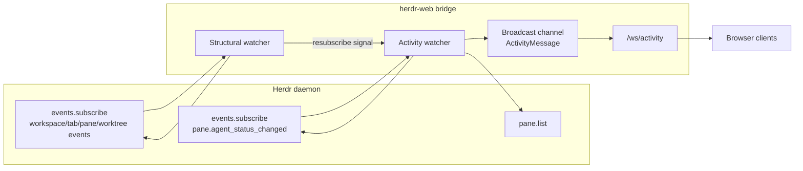
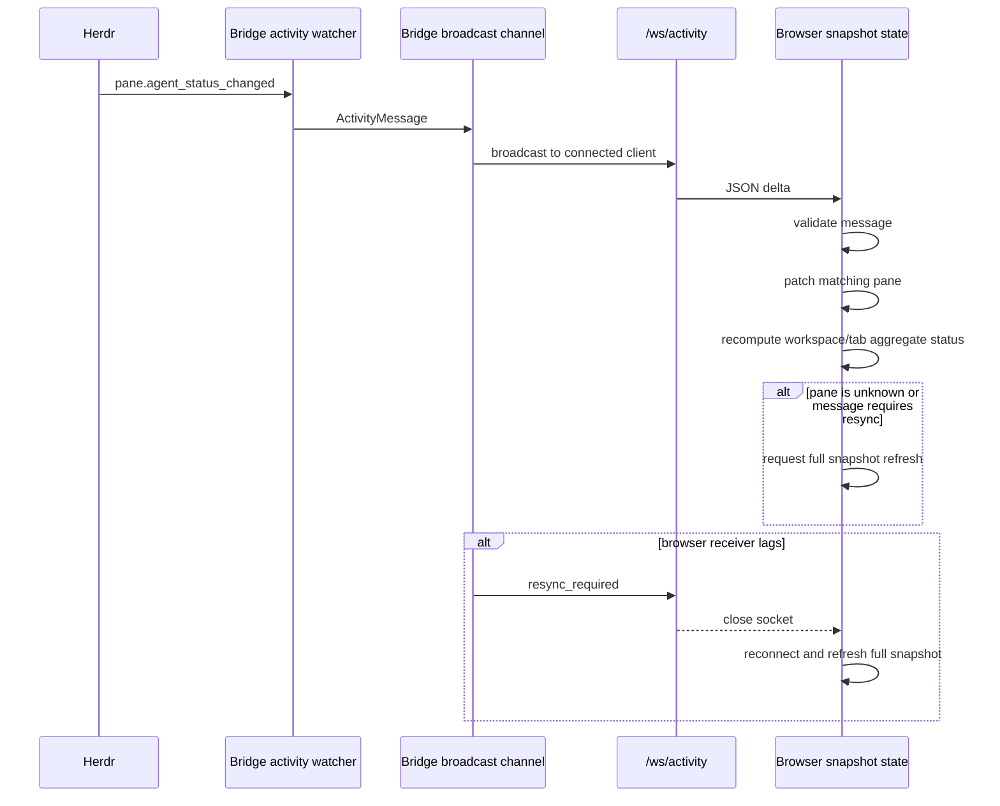
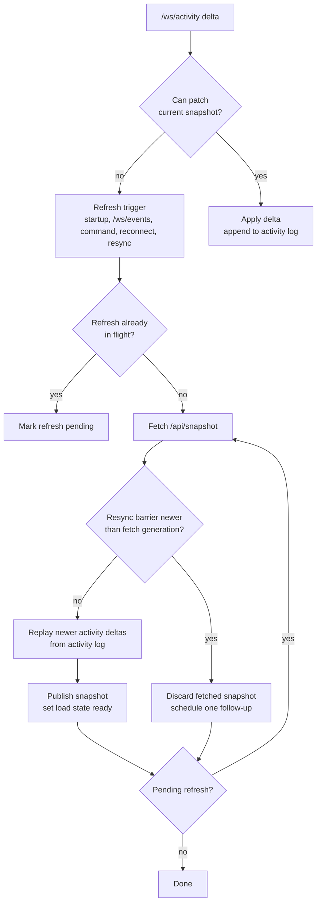

# Agent Activity Efficiency Design

`herdr-web` keeps full snapshots as the coherent model for workspace, tab, pane, layout, and
selection state. Agent activity is different: status and presentation fields can change frequently,
and those changes are small. The implemented design streams those frequent activity changes as
bridge-owned deltas while retaining full snapshots for initial load, structural state, and recovery.

## Goals

- Deliver agent status and presentation changes to browsers quickly.
- Avoid rebuilding and transferring a full snapshot for routine activity changes.
- Keep Herdr event subscription details inside the bridge, not in each browser client.
- Preserve full snapshots as the authoritative recovery path.
- Make stale refresh and reconnect behavior deterministic.

## Bridge-Owned Activity Subscriptions

The bridge starts one shared activity watcher per bridge process. Browser count does not multiply
Herdr activity subscriptions.

The activity watcher:

- reads the current pane set with `pane.list`
- subscribes to Herdr `pane.agent_status_changed` events for each current pane
- converts Herdr subscription events into compact web-facing activity messages
- broadcasts those messages over a bridge-local broadcast channel
- retries with backoff if the Herdr subscription fails

A separate structural watcher also runs in the bridge. It listens for workspace, tab, pane, and
worktree structural events only so it can tell the activity watcher when the subscribed pane set may
need to be rebuilt. The activity watcher compares the new sorted pane IDs with the currently
subscribed IDs and keeps the existing subscription when the pane set is unchanged.



## `/ws/activity` Delta Flow

Browsers connect to `GET /ws/activity`. The route uses the same request gating as the other browser
WebSocket routes.

Normal activity messages are full replacements for the pane agent presentation fields:

```json
{
  "type": "pane.agent_status_changed",
  "pane_id": "pane-1",
  "workspace_id": "workspace-1",
  "agent_status": "working",
  "agent": "codex",
  "title": "Reviewing changes",
  "display_agent": "Codex",
  "custom_status": "running tests",
  "state_labels": { "working": "Running" }
}
```

Nullable presentation fields are serialized explicitly as `null` when absent, and `state_labels` is
always an object. That keeps browser patching simple: the message replaces the pane's current agent
presentation state instead of merging sparse partial fields.

If a browser activity receiver lags behind the bridge broadcast channel, the bridge sends:

```json
{
  "type": "resync_required",
  "reason": "activity receiver lagged"
}
```

The bridge then closes that activity socket. The browser reconnects and refreshes the full snapshot.



## Frontend Delta Patching

The browser still renders from a `Snapshot`. Activity deltas patch that snapshot in memory.

On a valid `pane.agent_status_changed` message, the browser:

- finds the pane by `pane_id`
- verifies the pane still belongs to the reported `workspace_id`
- replaces `agent_status`, `agent`, `title`, `display_agent`, `custom_status`, and `state_labels`
- recomputes the affected workspace and tab aggregate statuses

If the pane is missing or belongs to a different workspace, the browser does not create or move the
pane from the delta. That situation means the structural snapshot is stale, so the browser requests
a full snapshot refresh.

Unknown future message types are ignored. Malformed known message types trigger a full refresh
because the browser cannot safely determine whether the current snapshot is stale.

## Full Snapshot Refresh And Recovery

Full snapshots still exist because activity deltas are intentionally narrow. A full snapshot remains
the authoritative representation of:

- workspace, tab, and pane membership
- layout snapshots
- selected pane and focus state
- structural changes
- startup and reconnect state
- recovery after missed or invalid activity deltas

The frontend uses a single-flight refresh controller so multiple refresh triggers do not create
duplicate concurrent snapshot fetches. If a refresh is already in flight, later triggers mark one
pending refresh. When the in-flight refresh completes, one follow-up refresh runs if needed.

Activity deltas are generation-stamped in a bounded browser-side log. When a full snapshot fetch was
started before newer activity deltas arrived, the browser replays newer applicable deltas onto the
fresh snapshot before publishing it. If a resync barrier was raised during the fetch, the stale
snapshot is discarded and a follow-up refresh is requested instead.



## Resubscribe And Reconnect Behavior

The activity subscription must be rebuilt when the pane set changes. The bridge rebuilds from
`pane.list` rather than trusting structural event payloads, because the current pane list is the
subscription source of truth.

The watcher avoids unnecessary churn:

- empty pane sets do not create empty Herdr subscription requests; the watcher waits for a local
  structural signal instead
- focus-only or other structural events that do not change the sorted pane ID set keep the existing
  activity subscription open
- changed pane sets close and reopen the Herdr activity subscription after a short debounce

The browser opens `/ws/activity` with reconnect backoff. Each open or reconnect requests a full
snapshot refresh through the same single-flight controller so activity changes missed while the
socket was disconnected are recovered promptly.

## Error Handling

- Herdr subscription failures retry with exponential backoff.
- Activity socket receiver lag sends `resync_required` and closes the socket.
- Unknown panes, workspace mismatches, and malformed known messages trigger full snapshot refresh.
- Partial JSON lines from Herdr event streams are buffered as bytes across read timeouts and parsed
  only when a complete newline-delimited message is available.

## Why Full Snapshots Remain

Activity deltas are optimized for frequent pane agent presentation changes. They are not a complete
state stream and are not durable. Full snapshots remain necessary because they provide a coherent
state boundary for structure, layout, startup, reconnect, and recovery. The design improves the
common high-frequency path without replacing the reliable full-state path.
